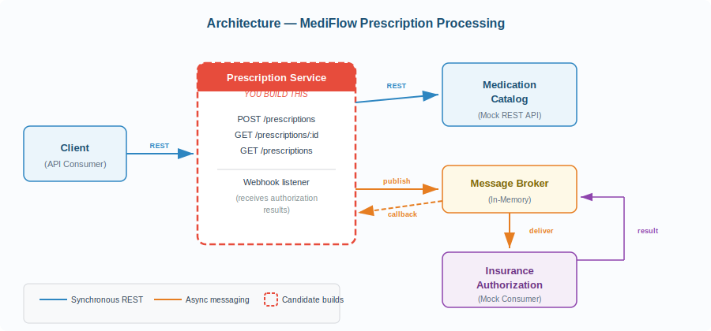

# MediFlow — Medical Prescription Processing

## Technical Challenge: Systems Integration

| | |
|---|---|
| **Duration** | 60 minutes |
| **Level** | Mid-Senior |
| **Format** | Hands-on development |
| **Stack** | Node.js + TypeScript |

---

## 1. Context

MediFlow is a clinical management platform migrating from a monolith to a service-based architecture. Your task is to build the **Prescription Processing** service, responsible for orchestrating the creation of medical prescriptions. This service integrates with two existing systems:

- **Medication Catalog** — Synchronous REST API. Contains the medication catalog with availability and inventory information.
- **Insurance Authorization** — Asynchronous service. Receives authorization requests through a message queue and publishes its decisions (approval or rejection) to a topic.

## 2. Architecture

The following diagram shows the system components and how they interact. **The dashed red box is what you must implement**; everything else is already provided.



- **REST protocol (synchronous):** your service queries the Medication Catalog and exposes HTTP endpoints to the client.
- **Messaging protocol (asynchronous):** your service publishes authorization requests to a queue. The Insurance Authorization mock processes them and publishes the result to a topic. Your service receives that result via webhook (HTTP callback).

## 3. Business Rules

Your service must ensure the following rules are met. How you implement them — the order of operations, code structure, HTTP status codes — is your decision.

### Domain Invariants

- **Existence:** a prescription cannot be created with medications that don't exist in the catalog.
- **Availability:** each medication's inventory must be reserved before requesting authorization. A medication's reservable stock is `stock_total - stock_reserved`.
- **Compensation:** if reserving a medication fails, all previously made reservations within the same prescription must be released.
- **Mandatory authorization:** every prescription requires insurance authorization before confirmation. The request is sent through the messaging queue.
- **State consistency:** a prescription must reflect its real state at all times. If authorization is rejected, reserved inventory must be released.
- **Resilience:** the Medication Catalog is an unstable external service. Your service must handle transient failures without propagating unnecessary errors to the client.
- **Asynchrony:** prescription creation must not block waiting for the insurance response. The client receives an immediate response and queries the status later.

### Required Endpoints

Your service must expose, at minimum, these endpoints:

- `POST /prescriptions` — create a prescription.
- `GET /prescriptions/:id` — query the current status of a prescription.
- `GET /prescriptions` — list prescriptions, with optional filtering by status.

HTTP status codes, the exact format of error responses, and any additional endpoints you consider necessary are up to you. **Document your decisions in the README.**

### Input Payload (Reference)

```json
// POST /prescriptions
{
  "patient_id": "PAT-001",
  "physician_id": "DOC-042",
  "items": [
    { "medication_id": "MED-001", "quantity": 2 },
    { "medication_id": "MED-003", "quantity": 1 }
  ]
}
```

> **Scenario:** A physician sends a prescription with one or more medications. Your service must verify that the medications exist and are available, reserve inventory, request insurance authorization, and reflect the final result in the prescription's state. Both the catalog and the message broker are already implemented as mocks in the repository.

> **Note on persistence:** You don't need a real database. Storing prescriptions in in-memory data structures (Maps, arrays, objects) is perfectly valid and is not penalized in the evaluation. What matters is how you model and organize data, not where you store it.

## 4. Provided Dependencies

### 4.1 Medication Catalog (Mock REST API)

HTTP server on port **3050**. Below is the full contract for each endpoint.

#### `GET /medications`

Returns the complete list of medications in the catalog.

Response (HTTP 200):
```json
[
  {
    "id": "MED-001",
    "name": "Amoxicillin 500mg",
    "amount": 12.50,
    "currency": "USD",
    "stock_total": 15,
    "stock_reserved": 3,
    "requires_cold_chain": false
  }
]
```

#### `GET /medications/:id`

Returns the details of a specific medication.

Response (HTTP 200):
```json
{
  "id": "MED-001",
  "name": "Amoxicillin 500mg",
  "amount": 12.50,
  "currency": "USD",
  "stock_total": 15,
  "stock_reserved": 3,
  "requires_cold_chain": false
}
```

Error — medication not found (HTTP 404):
```json
{
  "error": "medication_not_found",
  "message": "Medication MED-999 not found"
}
```

#### `POST /medications/:id/reserve`

Reserves inventory for a medication. Reservable stock is `stock_total - stock_reserved`.

Request body:
```json
{ "quantity": 2 }
```

Successful response (HTTP 200):
```json
{
  "id": "MED-001",
  "stock_total": 15,
  "stock_reserved": 5,
  "reserved_quantity": 2
}
```

Error — insufficient stock (HTTP 409):
```json
{
  "error": "insufficient_stock",
  "message": "Cannot reserve 10 units. Available: 12",
  "available": 12
}
```

#### `POST /medications/:id/release`

Releases previously reserved inventory.

Request body:
```json
{ "quantity": 2 }
```

Successful response (HTTP 200):
```json
{
  "id": "MED-001",
  "stock_total": 15,
  "stock_reserved": 3,
  "released_quantity": 2
}
```

> **Mock behavior:** The mock simulates realistic conditions:
> - Some calls respond with HTTP 503 (Service Unavailable)
> - Some calls have elevated latency (2-4 seconds)
> - Reserving with quantity > reservable stock returns HTTP 409

### 4.2 Message Broker (In-Memory)

In-memory message broker included in the repository. HTTP interface:

```
POST /publish    { "topic": "...", "message": {...} }
POST /subscribe  { "topic": "...", "callback_url": "http://..." }
GET  /messages   → View in-flight messages (debug)
```

The broker delivers messages via HTTP POST to the registered `callback_url`. If delivery fails, it retries up to 3 times with exponential backoff.

**Predefined topics:**

- `authorization.requests` — your service publishes authorization requests here.
- `authorization.results` — the Insurance Authorization mock publishes decisions here (~80% approved, ~20% rejected).

Authorization request message (`authorization.requests`):
```json
{
  "prescription_id": "RX-abc123",
  "patient_id": "PAT-001",
  "total_amount": 37.50,
  "currency": "USD",
  "items": [
    { "medication_id": "MED-001", "quantity": 2, "unit_amount": 12.50 }
  ]
}
```

Result message (`authorization.results`):
```json
{
  "prescription_id": "RX-abc123",
  "status": "approved | rejected",
  "authorization_code": "AUTH-xyz789",
  "timestamp": "2025-03-26T14:30:00Z"
}
```

### 4.3 Callback Contract (Webhook)

When your service subscribes to the `authorization.results` topic, you provide a `callback_url` that you define (e.g., `http://localhost:3000/webhooks/authorization`). The broker will send an HTTP POST to that URL whenever there's a new authorization result.

Request your endpoint will receive:
```
POST <your_callback_url>
Content-Type: application/json

{
  "topic": "authorization.results",
  "message": {
    "prescription_id": "RX-abc123",
    "status": "approved | rejected",
    "authorization_code": "AUTH-xyz789",
    "timestamp": "2025-03-26T14:30:00Z"
  }
}
```

Expected response from the broker:
```
HTTP 200 OK

// Any 2xx status indicates successful receipt.
// If your endpoint returns a non-2xx status or doesn't respond,
// the broker will retry up to 3 times with exponential backoff.
```

## 5. Evaluation Criteria

We're not looking for a perfect solution. We're looking for clear signals of how you think, design, and build software in a real-world context. The challenge is calibrated so that a solid candidate can complete the base requirements in 45-50 minutes, leaving time to refine.

| Criterion | Key indicators |
|---|---|
| **Functional correctness** | The full flow works: create prescription, process authorization, query status. Business rules are met. |
| **Error handling and resilience** | Retries on transient failures, inventory compensation, timeout handling, input validation. |
| **Code design and structure** | Separation of concerns, low coupling between layers, clear naming, readable code without excessive comments. |
| **Domain modeling** | Well-defined prescription states, clear transitions, consistent data. |
| **Technical decisions** | README justification of tradeoffs: chosen status codes, patterns used, what you'd improve with more time. |

> **What we value most:** A candidate who delivers fewer features but with robust error handling, well-structured code, and an honest README about what's missing and how they'd solve it, will be evaluated better than one who delivers everything without considering error cases or with hard-to-maintain code.

## 6. Deliverables

At the end of the hour, your repository must contain:

- Source code for the Prescription Processing service in TypeScript.
- README.md with: instructions to run, design decisions (including status codes and chosen patterns), known limitations, and what you'd do with more time.
- The service must start with a single command (e.g., `make run`, `docker-compose up`, `npm start`).

> **Note on the README:** The README is an integral part of the evaluation. We want to understand your thought process: what tradeoffs you made, what patterns you chose and why, how you decided on status codes, and what you'd change if you had a week instead of an hour. A good README can compensate for incomplete features.

## 7. Getting Started

### Prerequisites

- [Docker](https://docs.docker.com/get-docker/) and Docker Compose
- [Node.js](https://nodejs.org/) v24 (see `.nvmrc`)

### Quick Start

**1. Start the dependencies** (Medication Catalog, Message Broker, Insurance Authorization):

```bash
make deps
```

**2. Verify the dependencies are running:**

```bash
make catalog-health   # Should return { "status": "ok" }
make broker-health    # Should return { "status": "ok" }
```

**3. Install dependencies and run your service:**

```bash
make dev    # Runs with ts-node (development mode)
# or
make run    # Builds and runs (production mode)
```

**4. When you're done, stop dependencies:**

```bash
make deps-down
```

### Useful Commands

| Command | Description |
|---|---|
| `make deps` | Start all dependency services |
| `make deps-down` | Stop all dependency services |
| `make dev` | Run prescription service in dev mode |
| `make run` | Build and run prescription service |
| `make logs` | Follow dependency logs |
| `make reset-catalog` | Reset medication stock to initial values |
| `make catalog-health` | Check Medication Catalog status |
| `make broker-health` | Check Message Broker status |

### Project Structure

```
.
├── dependencies/                # Mock Catalog + Broker + Insurance (DO NOT MODIFY)
│   ├── medication-catalog/
│   ├── message-broker/
│   └── insurance-authorization/
├── prescription-service/        # YOUR CODE HERE
│   ├── src/
│   │   ├── index.ts             # Entry point (Express app)
│   │   ├── routes/              # HTTP endpoints
│   │   ├── services/            # Business logic
│   │   ├── clients/             # HTTP clients for Catalog and Broker
│   │   ├── models/              # Domain types and interfaces
│   │   └── config.ts            # Configuration
│   ├── tests/
│   ├── tsconfig.json
│   └── package.json
├── docker-compose.yml
├── Makefile
└── README.md
```

**Stack:** Node.js + TypeScript + Express + Fetch API (built-in)
